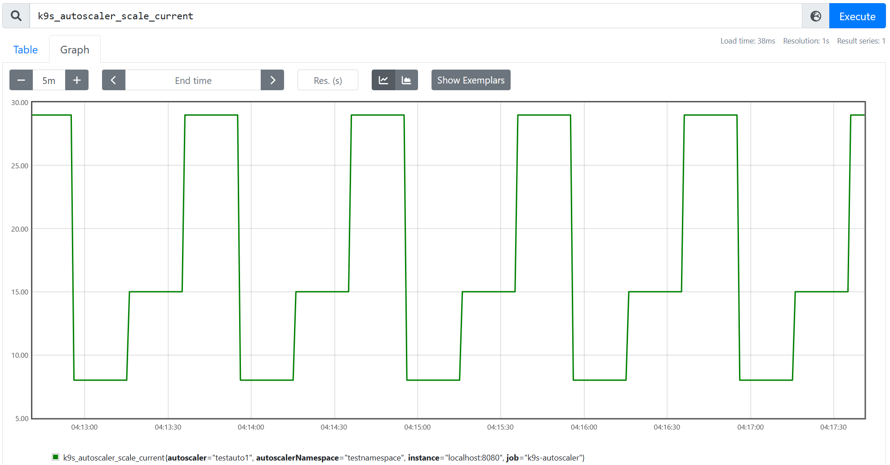
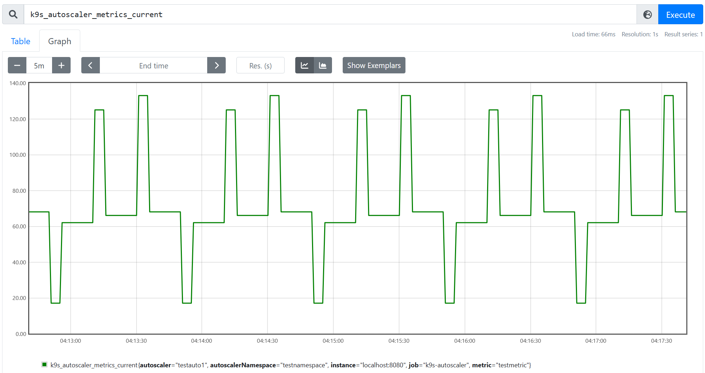

K9s Autoscaler
---
K9s Autoscaler is a weekend project to explore the idea of running Kubernetes Horizontal Pod Autoscaler as a standalone component outside of a Kubernetes cluster, to drive autoscaling for generic external objects using external metrics.

### Objectives
* Run outside Kubernetes environment while using latest and greates code from HPA.
* Provide configuration file based autoscaler discovery and configuration.
* Build metrics backends for generic Prometheus servers and Azure Monitor.
* Build REST HTTP API to discover and configure autoscalers.
* Fully extensible in and out of tree for storage, metrics and scaling adapters.

### Project status
Early stage development.

#### Available storage clients
* **Inline**: Load autoscaler configurations from a yaml file.

#### Available metrics clients
* **Sim**: Simulation of dummy metrics for testing.
* **Azure Monitor**: Read metric values of a resource from Azure Monitor metrics API.

#### Available scalers
* **Sim**: Simulation of dummy scaling that works with Sim metrics clients to provide proportional scale metrics.

### Current usage

Command line tool is available that runs in-tree clients:
```
$ make
$ bin/k9s-autoscaler controller --config examples/intree/sim.yaml
```

Sample configuration:
```yaml
# storageClient provides an adapter for autoscaler discovery and configuration.
storageClient:
  # inline is a built-in storage client that uses in-line yaml configuration
  # for autoscalers.
  config:
    "@type": type.googleapis.com/k9sautoscaler.providers.storage.proto.InlineStorageConfig
    autoscalers:
    - name: testauto1
      namespace: testnamespace
      spec:
        min: 1
        max: 30
        metrics:
        # list of metrics and their targets. metricsClient must be able to provide
        # values for these.
        - name: testmetric
          target: 70
          selector:
            # internal selector used specifically by sim metrics and scaler.
            AUTOSCALER_NAME: testauto1
# metricsClient provides an adapter for reading metrics values.
metricsClient:
  # sim is a metricsClient and scalingClient that can be used to simulate scaling
  # and metrics reading based on predefined time intervals.
  # it returns a metric based on average simulated load percentage.
  config:
    "@type": type.googleapis.com/k9sautoscaler.providers.metrics.proto.SimMetricsConfig
    metricName: testmetric
    autoscalersConfig:
    - autoscalerName: testauto1
      autoscalerNamespace: testnamespace
      # tell the simulation the max possible load per instance. used to calculate
      # load percentage metric.
      maxLoadPerInstance: 10.0
      # describe simulated total load on the system in a periodic manner. once
      # time reaches the end of all defined periods, it starts from first period
      # again.
      load:
      - timespan: 20s
        load: 100
      - timespan: 20s
        load: 200 
      - timespan: 20s
        load: 50
# scalingClient provides an adapter for getting and setting scale.
scalingClient:
  # sim is a scalingClient that works with sim metrics client.
  config:
    "@type": type.googleapis.com/k9sautoscaler.providers.metrics.proto.SimMetricsConfig
# eventsClient provides an adapter for the autoscaler events.
eventsClient:
  # klog logs status updates to klogger.
  config:
    "@type": type.googleapis.com/k9sautoscaler.providers.events.proto.KLog
# run the autoscaler sync loop every 5s. in a production setup a typical value
# is 15s.
resyncPeriod: 5s
```

After running the above for a few minutes, prometheus would display something like this:

<p align="center">
  
</p>
<p align="center">
  
</p>

#### Kubernetes version
v1.27.6